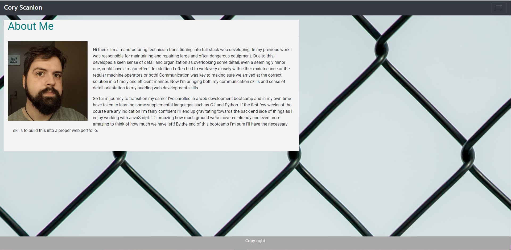

# HW2-CSS-Bootstrap-Responsive-Portfolio
This is a repository for the code and all of the assets to create a basic portfolio.

The objective of the project was to create a basic portfolio using Bootstrap. 

I used Bootstrap for the navbar,contact card, and to set up a grid system to work with for the portfolio page. 
Index.html contains a headshot and a small blurb about me. Portfolio.html contains 5 images in a grid system showing other things I've done in this course.
Contact.html shows a mockup for a contact card made using bootstrap.

## Example snippit of the code after changes and link to the live site
https://thecoaxial.github.io/HW2-CSS-Bootstrap-Responsive-Portfolio/Index.html

